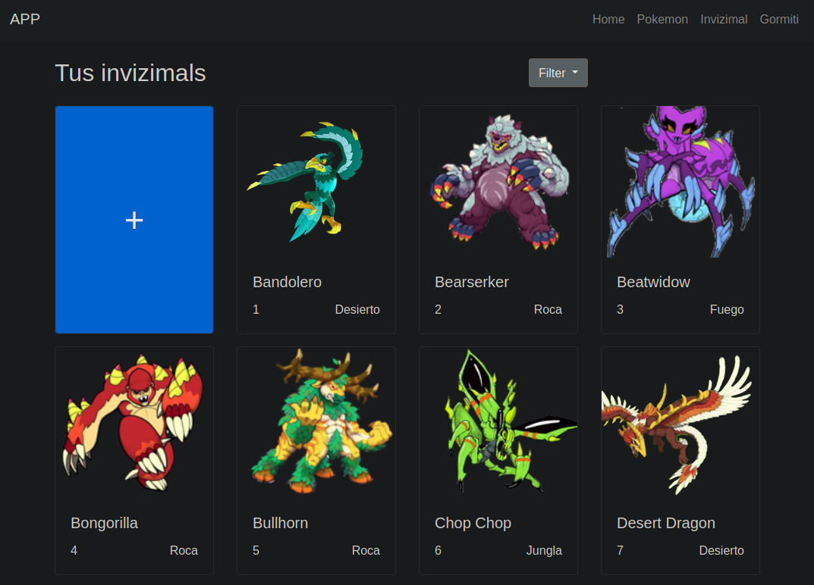

# Digital Collection App

### This application is a digital collection manager for your favourite characters, such as Pokemon, Invizimal and Gormiti.



## Getting Started

These instructions will get you a copy of the project up and running on your local machine for development and testing purposes. 

## Prerequisites

You'll need to install:

- [Node.js](https://nodejs.org/)
- [MongoDB](https://www.mongodb.com/)

Ensure MongoDB is running on your system or use a cloud-based instance.

## Installing

A step by step series of examples that tell you how to get a development env running:

1. Clone the repository

```bash
git clone https://github.com/0xJVR/bd2-App
```

2. Enter the project directory

```bash
cd bd2-App
```

3. Install the dependencies

```bash
npm install
```

3. Run the tests and populate the database

```bash
npm test
```

5. Start the application

```bash
npm start
```

The service will start on port 3000. The webpage will be available at `http://localhost:3000/` and the API at `http://localhost:3000/api/`.

## Connecting into your MongoBD instance

Modify `config/mongodb/mongodb-config.json` to match your server configuration.

In case you have authentication, create a new user for the app database with the needed privileges on mongoSH.

This is how you can create a new database user for your API connection to mongoDB:

```mongoSH
use ApiExpress
```

```mongoSH
db.createUser({user:"YourApiUser", pwd:"YourApiPassword", roles:[{ role:"dbOwner", db:"ApiExpress" }] })
```

## Using the API

To interact with the REST API, you can use tools like [Postman](https://www.postman.com/) or `curl`.

### API Endpoints

Here are the available endpoints:

- `gormiti` - For the Gormiti collection
- `invizimal` - For the Invizimal collection
- `pokemon` - For the Pokemon collection
